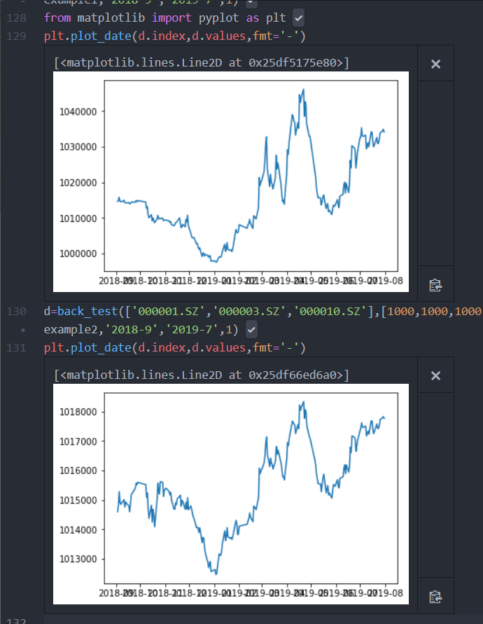

## 回测函数部分

语法：

`back_test(begin_asset_id:list<str>,begin_asset_amount:list<int>,begin_cash:float,policy:function,begin_t:str,end_t:str,delta_t:int)`

描述:根据给定初始资产配置、给定策略函数进行回测模拟

前置条件：

begin_asset_id 为id的list ,如['000001.SZ','000002.SZ']
begin_asset_amount为初始资产的配置的list，对于股票单位为股数，如[1000,1000]
begin_cash为初始资金数量的浮点数
begin_t、end_t 为 str类型时间戳，如'2019-8-1'、'2019-08-01'、'2019-8'均合法
delta_t为整型为触发回测函数的天数
policy 为策略函数，形式为`policy_example1(asset_dat:Dataframe, asset_amount:list<int>,cash:float)`
	其中asset_dat为一个Dataframe,行是自开始回测到当前前一日的开盘价信息；每一列为一项资产（与begin_asset_id相同）
	asset_amount为当前资产配置的整型list
	cash为当前剩余可用资金
	输出为由policy产生的新资产配置list

后置条件：
返回一个Dataframe，目前是只有一列，为总资产的价值，每一行为一个时间戳

## 细节说明：
1. 对于非法asset_id输入,即找不到该id对应股票数据的，目前直接删除该id和对应持仓
2. 目前模拟为以开盘价成交计算
3. 对于策略合法性的自动检验上：
	- 现金不够时按照输入id顺序尽量多地购买；
	- 不满足100股整数倍的，以四舍五入改变持仓
	- 尚未包含手续费计算
4. 尚不支持期权期货（输入没有期权期货的数据；计算上和成交规则上也没有针对期权期货设计），等期权期货数据获取到了我再写吧……
4. 若策略函数需其他输入、回测输出更多其他信息的（如持仓配置的历史变化等）可联系我修改代码 

## 使用样例
```python
#一个前一日涨就加仓、跌就减仓的朴素策略
def policy_example1(asset_dat, asset_amount,cash):
    is_rise=asset_dat.iloc[-2]<=asset_dat.iloc[-1]
    new_p=[]
    for ii,i in enumerate(asset_amount):
        if is_rise[ii]:
            new_p+=[i+1000]
        else:
            new_p+=[i-1000]
    return new_p

#一个保持原样不变的对照组策略
def policy_example2(asset_dat,asset_amount,cash):
    return asset_amount
    
d=back_test(['000001.SZ','000003.SZ','000010.SZ'],[1000,1000,1000],1000000,policy_example1,'2018-9','2019-7',1)
from matplotlib import pyplot as plt
plt.plot_date(d.index,d.values,fmt='-')
d=back_test(['000001.SZ','000003.SZ','000010.SZ'],[1000,1000,1000],1000000,policy_example2,'2018-9','2019-7',1)
plt.plot_date(d.index,d.values,fmt='-')

#输入中000003.SZ不存在，会被抛弃
#回测时间为2018-9-1~2019-7-1，每日触发一次策略
```



可以看出用了这样的盲目的策略之后亏得更惨也赚得更多了……